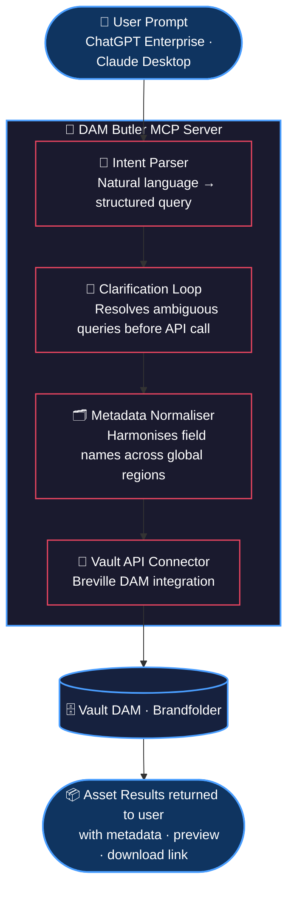

# DAM Butler MCP

An MCP server that gives ChatGPT Enterprise and Claude natural 
language access to Breville's Vault DAM system.

Built as a weekend prototype. Demoed to product leadership 
September 2025. Architecture adopted and taken to production 
by the Breville product engineering team.

▶️ [Watch the demo](https://www.youtube.com/watch?v=UOeHNyh5A7Y)

---
## The Problem

Breville's Vault DAM held thousands of product images, brand 
assets, and marketing materials across global markets.

Finding the right asset required knowing the exact folder 
structure, taxonomy, or metadata tags. Non-technical users — 
regional brand managers, marketers, content producers — had 
to ask someone who knew the system.

That created a repeatable bottleneck. DAM Butler removes it.

---

## What It Does

Translates natural language into structured DAM API queries.

Ask:
> "Find the Barista Express hero shot in white, approved for 
> EU markets, updated after January 2025"

Get back: the right asset, with metadata, directly in chat.

No taxonomy knowledge required. No folder navigation.

## Architecture

---

## Vault DAM (Brandfolder)

**Stack:** MCP protocol · Claude API · ChatGPT Enterprise 
Custom GPT · Brandfolder/Vault API · Node.js

**Development approach:** Built using Claude and ChatGPT in 
parallel. Used Contextus (beta) to maintain shared context 
across model switches — eliminating cold-start repetition 
in multi-LLM prototyping workflows.

---

## Key Engineering Decisions

**Clarification before execution**
Ambiguous queries returned oversized result sets. Fixed with 
a clarification question loop that runs before the API call, 
not after. Reduces noise, improves user trust.

**Metadata normalisation layer**
Asset metadata field names were inconsistent across Breville's 
regional markets (US, AU, UK). Added a normalisation step that 
harmonises field names before applying filters. Without this, 
region-specific queries silently failed.

**Why MCP over direct API integration**
MCP enforces a strict tool contract between the LLM and the 
API. Given Vault's strict schema requirements, MCP prevented 
hallucinated field names from reaching the API layer — a 
critical reliability improvement over unconstrained function 
calling.

---

## What It Generalises To

Any large structured asset or knowledge repository where 
non-technical users need natural language access:

- Legal document and contract management
- Product Information Management (PIM)
- Enterprise content repositories  
- Compliance and audit libraries
- Internal knowledge bases

---

## Outcome

Prototype demoed September 2025. Product team adopted the 
architecture and shipped it as an internal tool for Breville's 
global brand and content teams.

---

## Note on Repository

This is a sanitised version of the original prototype. 
API credentials and Breville-specific endpoints have been 
replaced with environment variable references and mock 
connectors for public sharing.
